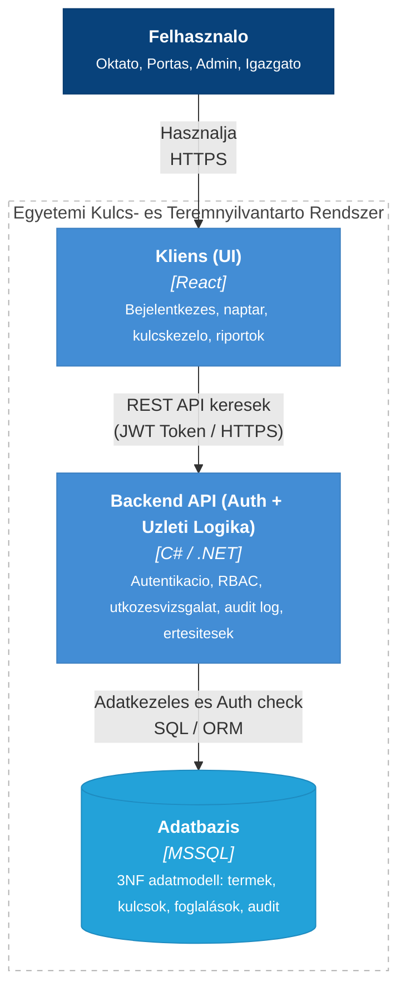

# egyetemi-kulcskezelo
Egyetemi Kulcs- és Teremnyilvántartó Rendszer PROJEKT LABOR - 2026/27/1 Csoport munka

---

## 1. A projekt celja es attekintese

Az egyetemi oktatasi termek, laborok, valamint a hozzajuk tartozo fizikai kulcsok nyilvantartasa gyakran manualisan, papiralapon tortenik, ami adminisztracios terhet, kulcselvesztest es foglalasi utkozeseket eredmenyez.

A rendszer celja egy kozpontositott, digitalis felulet biztositasa, amely:
- Valos idoben koveti a fizikai kulcsok kiadasat es visszavetelet.
- Kezeli az oktatok idopontalapu teremfoglalasait es a termek kapacitasat.
- Digitalis hibajegykezelo modult nyujt a serult kulcsok, zarak vagy teremi eszkozok bejelentesere.
- Adminisztratori engedelyhez koti a mesterkulcsok felvetelet es audit naplot vezet a folyamatokrol.

---

## 2. Szerepkorok es jogosultsagok

| Szerepkor | Jogosultsagok es feladatok |
| :--- | :--- |
| **Oktato** | Szabad termek keresese kapacitas alapjan, teremfoglalas inditasa, sajat foglalasok megtekintese, hibajegyek bejelentese. |
| **Portas** | Kulcsok fizikai kiadasanak es visszavetelenek gyors rogzitese, kulcsstatuszok lekerdezese (benn/kint), serulesek es vesztesegek azonnali jelzese. |
| **Admin** | Felhasznaloi fiokok es szerepkorok kezelese, uj termek es kulcsok felvitele, karbantartasok elrendelese, mesterkulcs-jogok kiosztasa, teljes audit log elerese. |
| **Igazgato** | Statisztikai kimutatasok, kihasznaltsagi riportok es hibanaplok megtekintese (olvasasi jog). |

---

## 3. Rendszerarchitektura (C4 Container szint)



---

## 4. Adatbazis sema (ER Diagram)

```mermaid
erDiagram
  FELHASZNALO ||--o{ FOGLALAS : letrehoz
  FELHASZNALO ||--o{ KULCSMOZGAS : vegzi
  FELHASZNALO ||--o{ HIBAJEGY : bejelent
  FELHASZNALO ||--o{ KARBANTARTAS : elrendel
  FELHASZNALO ||--o{ MESTERKULCS_JOG : kap
  TEREM ||--o{ KULCS : tartalmaz
  TEREM ||--o{ FOGLALAS : erint
  TEREM ||--o{ HIBAJEGY : erint
  TEREM ||--o{ KARBANTARTAS : erint
  KULCS ||--o{ KULCSMOZGAS : mozog
  KULCS ||--o{ HIBAJEGY : erint
  KULCS ||--o{ MESTERKULCS_JOG : jogosit
  FOGLALAS |o--o{ KULCSMOZGAS : kivalthat

  FELHASZNALO {
    int id PK
    string nev
    string email
    password jelszo
    string szerepkor
  }
  TEREM {
    string id PK
    string epulet
    int szint
    string nev
    int ferohely
    string felszereltseg
  }
  KULCS {
    int id PK
    string terem_id FK
    string tipus
  }
  FOGLALAS {
    int id PK
    int oktato_id FK
    string terem_id FK
    datetime kezdet
    datetime veg
    string statusz
  }
  KULCSMOZGAS {
    int id PK
    int kulcs_id FK
    int felhasznalo_id FK
    int foglalas_id FK
    string tipus
    datetime idobelyeg
    string azonositas_mod
  }
  HIBAJEGY {
    int id PK
    int kulcs_id FK
    string terem_id FK
    int bejelento_id FK
    string leiras
    string statusz
  }
  KARBANTARTAS {
    int id PK
    string terem_id FK
    int admin_id FK
    datetime kezdet
    datetime veg
  }
  MESTERKULCS_JOG {
    int id PK
    int kulcs_id FK
    int felhasznalo_id FK
    int admin_id FK
    date datum
  }