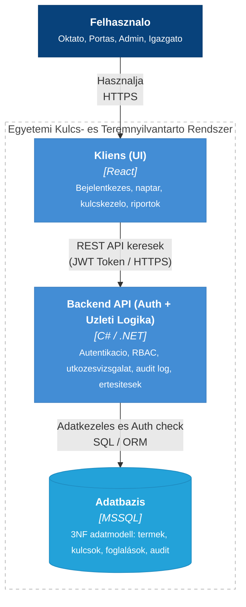
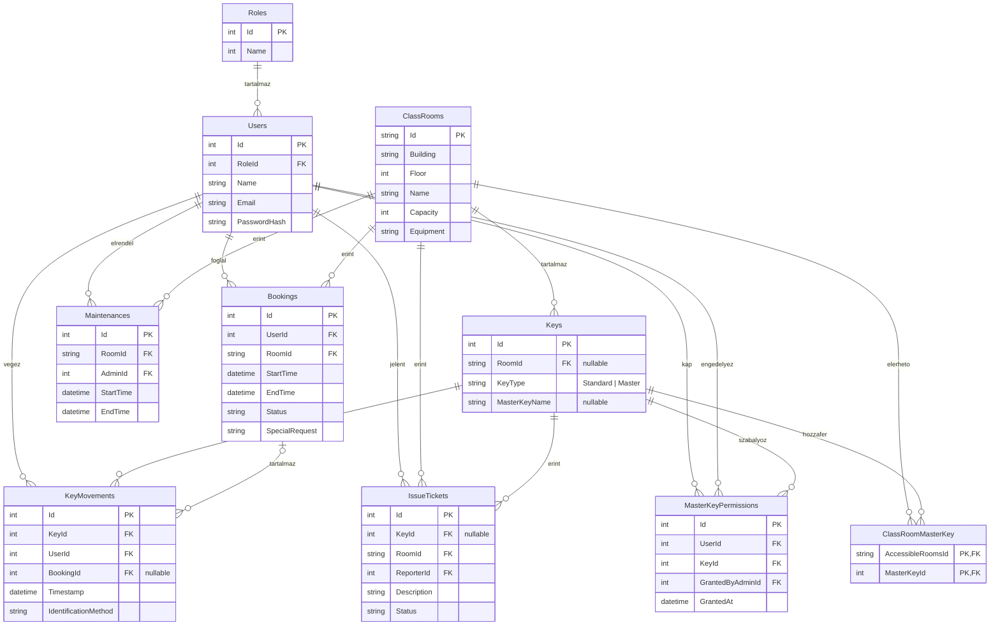

# egyetemi-kulcskezelo
Egyetemi Kulcs- és Teremnyilvántartó Rendszer PROJEKT LABOR - 2026/27/1 Csoport munka

---

## 1. A projekt celja es attekintese

Az egyetemi oktatasi termek, laborok, valamint a hozzajuk tartozo fizikai kulcsok nyilvantartasa gyakran manualisan, papiralapon tortenik, ami adminisztracios terhet, kulcselvesztest es foglalasi utkozeseket eredmenyez.

A rendszer celja egy kozpontositott, digitalis felulet biztositasa, amely:
- Valos idoben koveti a fizikai kulcsok kiadasat es visszavetelet.
- Kezeli az oktatok idopontalapu teremfoglalasait es a termek kapacitasat.
- Digitalis hibajegykezelo modult nyujt a serult kulcsok, zarak vagy teremi eszkozok bejelentesere.
- Adminisztratori engedelyhez koti a mesterkulcsok felvetelet es audit naplot vezet a folyamatokrol.

---

## 2. Szerepkorok es jogosultsagok

| Szerepkor | Jogosultsagok es feladatok |
| :--- | :--- |
| **Oktato** | Szabad termek keresese kapacitas alapjan, teremfoglalas inditasa, sajat foglalasok megtekintese, hibajegyek bejelentese. |
| **Portas** | Kulcsok fizikai kiadasanak es visszavetelenek gyors rogzitese, kulcsstatuszok lekerdezese (benn/kint), serulesek es vesztesegek azonnali jelzese. |
| **Admin** | Felhasznaloi fiokok es szerepkorok kezelese, uj termek es kulcsok felvitele, karbantartasok elrendelese, mesterkulcs-jogok kiosztasa, teljes audit log elerese. |
| **Igazgato** | Statisztikai kimutatasok, kihasznaltsagi riportok es hibanaplok megtekintese (olvasasi jog). |

---

## 3. Rendszerinditas es fejlesztoi kornyezet

A projekt egy tobbkonteneres kornyezetben fut, amely magaban foglalja a **React** frontendet, a **.NET Core** backend REST API-t, valamint az **MSSQL** adatbazis-kiszolgalot. A teljes infrastruktura a legegyszerubben Docker segitsegevel indithato el.

### Elokovetelmenyek
- [Docker Desktop](https://www.docker.com/) telepitve es futtatva
- [Git](https://git-scm.com/)

### Gyors inditas
A projekt gyokerkonyvtaraban futtasd a kovetkezo parancsot:

```bash
docker compose up --build
```

A kontener-infrastruktura leallitasa:
```bash
docker compose down
```

### A futo szolgaltatasok portjai:
- Backend: 5000:8080
- Frontend: 3000:80
- Database: 1433:1433

---

## 4. Rendszerarchitektura (C4 Container szint)


```mermaid
graph TB
    user["<b>Felhasznalo</b><br/><small>Oktato, Portas, Admin, Igazgato</small>"]

    subgraph system_boundary ["Egyetemi Kulcs- es Teremnyilvantarto Rendszer"]
        direction TB
        
        spa["<b>Kliens (UI)</b><br/><i>[React]</i><br/><small>Bejelentkezes, naptar, kulcskezelo, riportok</small>"]
        backend["<b>Backend API (Auth + Uzleti Logika)</b><br/><i>[C# / .NET]</i><br/><small>Autentikacio, RBAC, utkozesvizsgalat, audit log, ertesitesek</small>"]
        database[("<b>Adatbazis</b><br/><i>[MSSQL]</i><br/><small>3NF adatmodell: termek, kulcsok, foglalások, audit</small>")]
    end

    user -->|"Hasznalja<br/>HTTPS"| spa
    spa -->|"REST API keresek<br/>(JWT Token / HTTPS)"| backend
    backend -->|"Adatkezeles es Auth check<br/>SQL / ORM"| database

    classDef person fill:#08427b,stroke:#073b6f,color:#fff;
    classDef container fill:#438dd5,stroke:#3c7fc0,color:#fff;
    classDef db fill:#23a2d9,stroke:#1e8bc0,color:#fff;
    classDef boundary fill:none,stroke:#b1b1b1,stroke-dasharray: 5 5,color:#444;

    class user person;
    class spa,backend container;
    class database db;
    class system_boundary boundary;
```

---

## 5. Adatbazis sema (ER Diagram)


```mermaid
erDiagram
    Roles ||--o{ Users : "tartalmaz"

    Users ||--o{ Bookings : "foglal"
    Users ||--o{ KeyMovements : "vegez"
    Users ||--o{ IssueTickets : "jelent"
    Users ||--o{ Maintenances : "elrendel"
    Users ||--o{ MasterKeyPermissions : "kap"
    Users ||--o{ MasterKeyPermissions : "engedelyez"

    ClassRooms ||--o{ Keys : "tartalmaz"
    ClassRooms ||--o{ Bookings : "erint"
    ClassRooms ||--o{ IssueTickets : "erint"
    ClassRooms ||--o{ Maintenances : "erint"
    ClassRooms ||--o{ ClassRoomMasterKey : "elerheto"

    Keys ||--o{ KeyMovements : "mozog"
    Keys ||--o{ IssueTickets : "erint"
    Keys ||--o{ MasterKeyPermissions : "szabalyoz"
    Keys ||--o{ ClassRoomMasterKey : "hozzafer"

    Bookings |o--o{ KeyMovements : "tartalmaz"

    Roles {
        int Id PK
        int Name
    }

    Users {
        int Id PK
        int RoleId FK
        string Name
        string Email
        string PasswordHash
    }

    ClassRooms {
        string Id PK
        string Building
        int Floor
        string Name
        int Capacity
        string Equipment
    }

    Keys {
        int Id PK
        string RoomId FK "nullable"
        string KeyType "Standard | Master"
        string MasterKeyName "nullable"
    }

    ClassRoomMasterKey {
        string AccessibleRoomsId PK,FK
        int MasterKeyId PK,FK
    }

    MasterKeyPermissions {
        int Id PK
        int UserId FK
        int KeyId FK
        int GrantedByAdminId FK
        datetime GrantedAt
    }

    Bookings {
        int Id PK
        int UserId FK
        string RoomId FK
        datetime StartTime
        datetime EndTime
        string Status
        string SpecialRequest
    }

    KeyMovements {
        int Id PK
        int KeyId FK
        int UserId FK
        int BookingId FK "nullable"
        datetime Timestamp
        string IdentificationMethod
    }

    IssueTickets {
        int Id PK
        int KeyId FK "nullable"
        string RoomId FK
        int ReporterId FK
        string Description
        string Status
    }

    Maintenances {
        int Id PK
        string RoomId FK
        int AdminId FK
        datetime StartTime
        datetime EndTime
    }
```